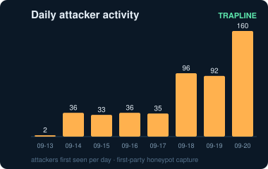
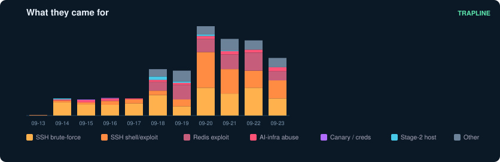
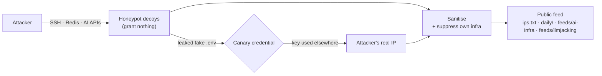

# Trapline IOC feed

Free, first-party threat intelligence from a honeypot sensor network — with a focus you
won't find in a generic blocklist: **attacks against AI infrastructure.** Alongside the
usual SSH and Redis brute-forcers, this feed tracks the IPs probing exposed
Ollama / vLLM / llama.cpp / Jupyter / Ray servers, hunting for GPUs, and — caught by
planted canary credentials — the ones stealing and reusing keys harvested from AI boxes
(LLMjacking). Every address took a hostile action against a decoy that hosts nothing
legitimate, so there is no reason for a real user to touch it. Updated hourly from live
capture.

[](ips.txt)
[](feeds/ai-infra.txt)
[](feeds/gpu-probing.txt)
[](feeds/llmjacking.txt)
[](daily)
[](LICENSE)





No aggregation of other people's lists, no scraped blocklists. These are IPs our own
sensors and canaries confirmed, first-hand.

## AI-infrastructure threat feeds

The reason this project exists. Most blocklists lump every attacker together; these three
carve out the AI-targeting activity our decoys and canaries catch first-hand. Each is a
plain one-IP-per-line list (with a `.csv` where noted), all-time cumulative, regenerated
hourly under [`feeds/`](feeds).

| Feed | What's in it | Context |
|---|---|---|
| [`feeds/ai-infra.txt`](feeds/ai-infra.txt) | Every IP that attacked AI infrastructure — drove an exposed-AI decoy, ran GPU/AI-hardware recon, or used a credential planted on an AI box. | [`.csv`](feeds/ai-infra.csv) |
| [`feeds/gpu-probing.txt`](feeds/gpu-probing.txt) | IPs running GPU/AI-hardware reconnaissance (`nvidia-smi`, `lspci \| grep nvidia`) — hunting for compute, not generic servers. | — |
| [`feeds/llmjacking.txt`](feeds/llmjacking.txt) | **LLMjacking**: IPs that *used* a cloud key we planted in an AI server's `.env`. Canary-confirmed, zero ambiguity (confidence 98). | [`.csv`](feeds/llmjacking.csv) |

```
curl -s https://raw.githubusercontent.com/Zikmadol/trapline-ioc/main/feeds/ai-infra.txt
```

Read [the LLMjacking writeup](reports/llmjacking-canary.md) for how a planted canary caught
an attacker our sensors never even saw — the key was stolen from one host and used from
another minutes later.

## Which list to use

Two tiers, so you can pick precision or coverage:

| List | What it is | Use it to |
|---|---|---|
| [`ips.txt`](ips.txt) | **Curated — confirmed malicious.** Every IP took a hostile action; known research scanners are excluded. | Block. This is the safe default. |
| [`active.txt`](active.txt) | Curated, **aged**: only IPs seen in the last 90 days. | Block with a self-cleaning list that drops stale IPs. |
| [`feeds/all-observed.txt`](feeds/all-observed.txt) | **Broad** — everything the sensors flagged, *including* identified research scanners (tagged `research-scanner`). | Hunt and enrich. **Not** a blocklist. |

Benign internet-wide scanners (Censys, Shadowserver, Palo Alto Xpanse, Shodan, …) are kept
out of the curated lists so you don't block legitimate research. The exact set we exclude
is published in [`allowlist.txt`](allowlist.txt) — open an issue to add or correct a range.

## Use it

Plain list, one IP per line — drop it straight into a firewall, an allowlist checker, or
a SIEM:

```
curl -s https://raw.githubusercontent.com/Zikmadol/trapline-ioc/main/ips.txt
```

Need context? [`indicators.csv`](indicators.csv) and [`indicators.json`](indicators.json)
carry the category, confidence, and first/last-seen dates for each IP. See
[SCHEMA.md](SCHEMA.md).

Want just what's new? The [`daily/`](daily) folder has one file per day —
`daily/YYYY-MM-DD.txt` and `.csv` — holding the IPs first seen that day. Pull only the
dates you don't have yet:

```
curl -s https://raw.githubusercontent.com/Zikmadol/trapline-ioc/main/daily/$(date -u +%F).txt
```

Curious what the attackers actually do? [STATS.md](STATS.md) is a sanitised, aggregate view — top usernames and passwords tried, command families, and the GPU-hunting and canary signals — refreshed with the feed.

## What's in it

| Field | Meaning |
|---|---|
| `ip` | The attacker address. |
| `category` | What it did, e.g. `ssh-bruteforce`, `ollama-abuse`, `canary-aws-key`, `payload-host`. |
| `confidence` | 90 = direct observation on our decoys. 98 = used a credential we planted (unambiguous). |
| `first_seen` / `last_seen` | UTC dates we observed it. |
| `tags` | Coarse labels: protocol, `bruteforce`/`exploit`/`abuse`, `key-replay`, `canary`, `cloud-abuse`, `gpu-probing`, `stage2`. |

Confidence is deliberately high because there are no bystanders here. An IP that
brute-forced an SSH decoy, drove a fake AI endpoint, or used a leaked canary key is not a
misconfigured CDN — it chose to attack something with no legitimate purpose.

## How it's collected




The sensors are ordinary-looking servers that exist only to be attacked: an SSH endpoint,
Redis, and a set of exposed-AI decoys (Ollama, llama.cpp, vLLM, Jupyter, Ray). They grant
nothing and run nothing. A few of them leak a fake `.env` with canary credentials; when a
stolen key is used, the IP that used it lands here at the highest confidence.

Deliberately **not** published: the credentials and prompts attackers sent, client
fingerprints, sensor locations, and how the canaries are wired. This feed is the
actionable half — the addresses — nothing that would help an attacker evade the sensors.

## Cadence

Updated hourly from live capture. It's **append-only**: an IP is published once, into the
daily file for the day we first saw it, and never moved or removed — so the per-day
history stands even as old raw logs age out. `manifest.json` carries the `generated`
timestamp, the total count, and the covered date range.

## Accuracy & removals

This is best-effort threat data offered without warranty. If you believe an address is
listed in error — a shared NAT, a security scanner you operate, a rotated cloud IP — open a
[false-positive issue](../../issues/new?template=false-positive.md) and it will be reviewed.
Attacker IP addresses are processed on the basis of the legitimate interest in network
security; only addresses that took a hostile action are included. Known-benign
infrastructure is filtered on three layers: public DNS resolvers and bogons are dropped,
our own hosts are removed, and internet-wide research scanners (the set in
[`allowlist.txt`](allowlist.txt)) are excluded from the curated lists. Curated IPs also age
out of [`active.txt`](active.txt) after 90 quiet days, so a reassigned address doesn't sit
on a blocklist forever.

## License

[Creative Commons Attribution 4.0](LICENSE) (CC BY 4.0). Use it for anything — commercial
or not — just credit "Trapline IOC feed" with a link back.
